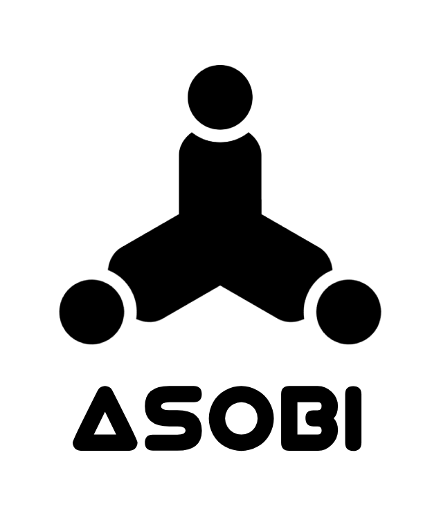

# Asobi - turn-based game framework

Asobi is a game client/server framework that allows you to create multiplayer turn-based games with a simple API. It is designed to be easy to use and to allow you to focus on building the game logic instead of messing around with all the boilerplate for managing rounds, turns, realtime updates etc.

There are 2 NPM packages in this repository:

- `@basementuniverse/asobi-server`
- `@basementuniverse/asobi-client`

The server package is used to create a game server running on Node and the client package can be used in the browser to connect to the server and interact with the game.

[Server documentation](./server/README.md)

[Client documentation](./client/README.md)

Some sample games are provided in the `examples` directory.
